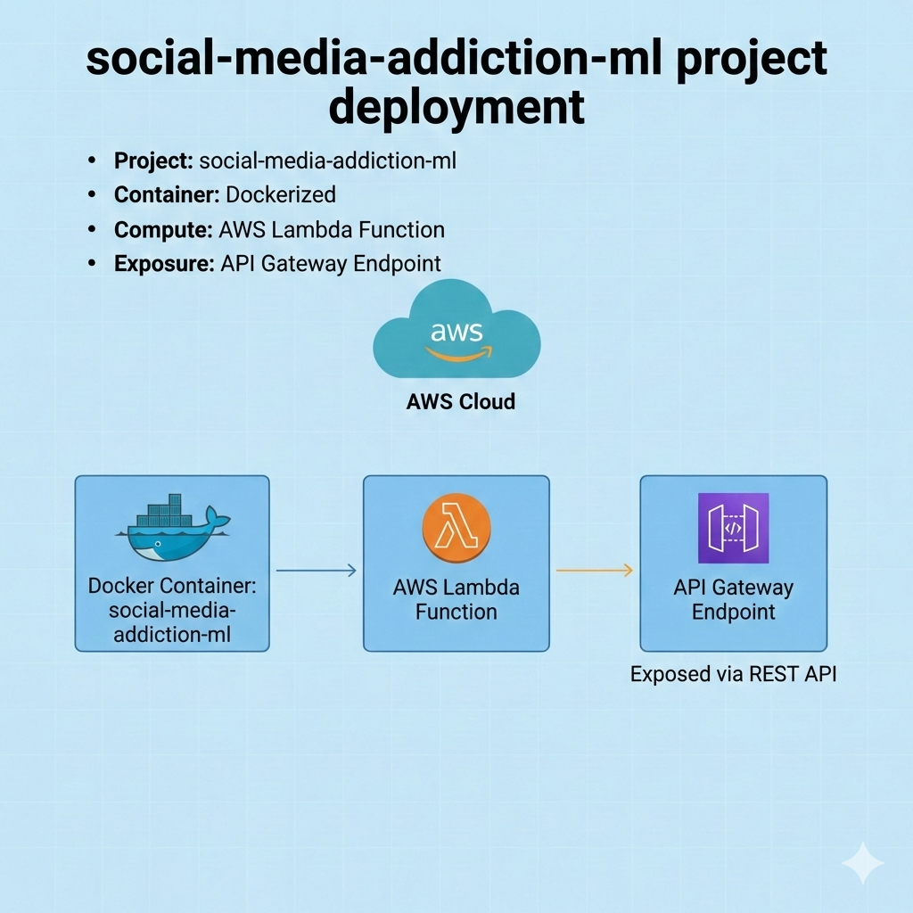

# Social Media Addiction Prediction

This project predicts social media addiction among students using machine learning models. The addiction score is transformed into a binary classification problem: addicted (score ≥ 7) or not addicted (score < 7).

## Table of Contents
- [Overview](#overview)
- [Dataset](#dataset)
- [Project Structure](#project-structure)
- [Data Preprocessing](#data-preprocessing)
- [Exploratory Data Analysis](#exploratory-data-analysis)
- [Model Training](#model-training)
- [Model Evaluation](#model-evaluation)
- [Usage](#usage)
- [Deployment](#deployment)
- [Requirements](#requirements)

## Overview

This machine learning project analyzes student social media usage patterns and provides predictions on addiction levels. The project includes:
- Data exploration and preprocessing
- Model training and evaluation
- REST API for predictions
- AWS Lambda deployment support

## Dataset

The dataset used is `Students-Social-Media-Addiction.csv`, obtained from KaggleHub (`adilshamim8/social-media-addiction-vs-relationships`).

**Key Features:**
- Age, gender, academic level
- Average daily usage hours, most used platform
- Sleep hours per night, mental health score
- Conflicts over social media, academic performance impact
- Relationship status

## Project Structure

```
├── SOCIALMEDIADDICTION.ipynb          # Main analysis and experimentation notebook
├── train.py                           # Model training script
├── predict.py                         # FastAPI REST API server
├── lambda.py                          # AWS Lambda handler
├── lambda-test.py                     # Lambda function testing
├── test.py                            # Model testing utilities
├── Students-Social-Media-Addiction.csv # Dataset
├── requirements.txt                   # Python dependencies
├── Dockerfile                         # Container image for AWS Lambda
├── Pipfile                            # Dependency lock file
└── README.md                          # This file
```

## Data Preprocessing

1. **Column Renaming**: Converted all column names to lowercase for consistency
2. **Irrelevant Feature Removal**: Dropped `student_id` as it doesn't contribute to predictions
3. **Missing Value Check**: Verified no missing values in the dataset
4. **One-Hot Encoding**: Converted categorical features using `DictVectorizer`
5. **Feature Scaling**: Normalized numerical features using `StandardScaler`

## Exploratory Data Analysis

Key insights from EDA:

- **Age Distribution**: Visualized student age ranges
- **Addiction Score Distribution**: Examined distribution and applied log transformation
- **Mutual Information**: Identified high-impact features:
  - `conflicts_over_social_media`
  - `mental_health_score`
  - `avg_daily_usage_hours`
  - `sleep_hours_per_night`
- **Correlation Analysis**: 
  - Positive correlations: `avg_daily_usage_hours`, `conflicts_over_social_media` with addiction
  - Negative correlations: `sleep_hours_per_night`, `mental_health_score` with addiction

## Model Training

The project trains and evaluates classification models using 80-20 train-test split with 25% validation set.

**Trained Models:**
1. Logistic Regression
2. Random Forest Classifier

Artifacts saved:
- `logistic_regression_model.pkl` - Trained model
- `scaler.pkl` - Feature scaler
- `dict_vectorizer.pkl` - Categorical feature encoder

## Model Evaluation

Both models demonstrate exceptional performance:

### Logistic Regression
- **Validation Set**: Accuracy: 1.00, AUC Score: 1.00
- **Test Set**: Accuracy: 0.99, AUC Score: 0.999

### Random Forest
- **Validation Set**: Accuracy: 1.00, AUC Score: 1.00
- **Test Set**: Accuracy: 0.99, AUC Score: 0.999

## Usage

### Training the Model

```bash
python train.py
```

This script:
- Loads and preprocesses the data
- Trains the Logistic Regression model
- Saves model artifacts for deployment

### Making Predictions via REST API

```bash
python predict.py
```

Then send POST requests to `http://localhost:8000/predict`:

```json
{
  "age": 20,
  "gender": "Male",
  "academic_level": "Bachelor",
  "avg_daily_usage_hours": 6.5,
  "most_used_platform": "Instagram",
  "sleep_hours_per_night": 6,
  "mental_health_score": 5,
  "conflicts_over_social_media": 3,
  "affects_academic_performance": "Yes",
  "relationship_status": "Single"
}
```

Response:
```json
{
  "prediction": 1,
  "probability": 0.95,
  "addiction_status": "Addicted"
}
```

## Cloud Deployment

### AWS Lambda

This project is docerized and deployed in AWS Lambda functions. Use this below function to test the lambda deployment (The lambda API url is given inside the python file. We can edit the input data details and run the file to obsewrve the inference).  
 

```bash
docker build -t social-media-addiction-lambda .
```

**Lambda Handler:** `lambda.lambda_handler`

The Lambda function:
- Accepts JSON requests with prediction input features
- Returns predictions with addiction status and probability
- Handles errors gracefully

### Testing Lambda Function


```bash
python lambda-test.py
```

## Since, the AWS free tier ending mid of January, the Lambda deployment url may not work, hence adding a video of the deployment here

https://github.com/user-attachments/assets/0cc7e533-ecad-412e-952b-2d3fc7d4030d

 Watch the video here -> https://github.com/mugunth19/Social-Media-Addiction-using-ML/blob/main/Screen_Recording_20260118_151104_Chrome.mp4

## Requirements

Install dependencies:

```bash
pip install -r requirements.txt
```

**Core Dependencies:**
- `numpy` - Numerical computations
- `scikit-learn` - Machine learning models and preprocessing
- `joblib` - Model serialization
- `pandas` - Data processing
- `fastapi` - REST API framework (for predict.py)
- `uvicorn` - ASGI server (for predict.py)

## Development

The main analysis and experimentation is documented in `SOCIALMEDIADDICTION.ipynb` Jupyter notebook.
